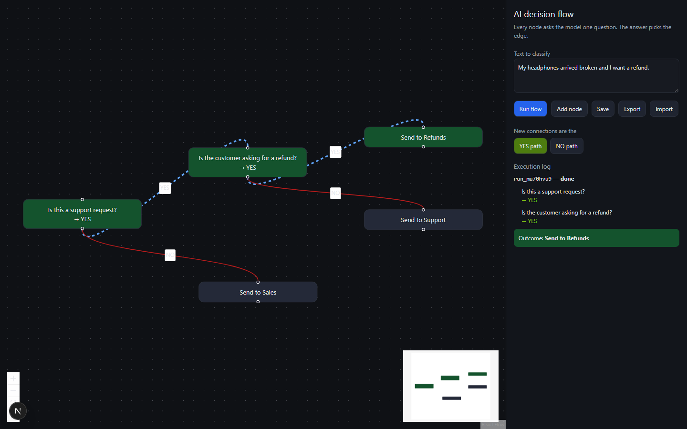
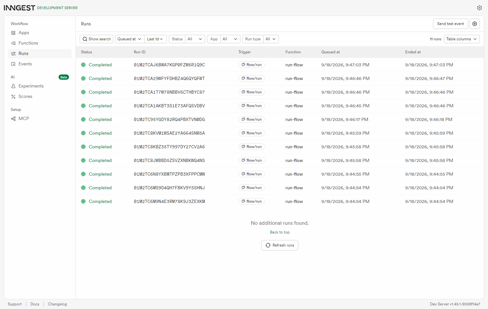

# AI decision flow

A flowchart you can draw in the browser, where **every box is a yes/no question
put to a language model**. The answer picks which arrow the run follows. Drag out
a support triage tree, type in a customer message, press **Run flow**, and watch
it light up box by box.

Execution runs on **Inngest**, one step per node. The canvas is **React Flow**.



Green boxes have been visited and carry the answer they gave. The blue dashed
line is the path actually taken. The panel on the right is the execution log.

## Run it — two terminals

```bash
npm install
cp .env.example .env.local        # LLM_STUB=1 means no key and no spending

# Terminal 1
npm run dev

# Terminal 2
npx inngest-cli@latest dev -u http://localhost:3000/api/inngest
```

Open **http://localhost:3000** for the editor and **http://localhost:8288** for
the Inngest dashboard.

```bash
npm test      # seven checks, no server and no key needed
```

**Trap — `INNGEST_DEV=1` is not optional.** Without it the JavaScript SDK assumes
it is talking to Inngest Cloud, `/api/inngest` answers **500**, and the log says
`In cloud mode but no signing key found`. The Python SDK infers this from
`is_production=False`; the JS one wants the environment variable. And if the Dev
Server started while that route was broken, it logs *"apps synced, disabling
auto-discovery"* and stops looking — restart it after you fix the route, or your
function list stays empty for no visible reason.

## Using a real model

Everything above runs on a stub. To use a real one, edit `.env.local`:

```
LLM_STUB=0
LLM_API_KEY=your_key
LLM_BASE_URL=https://api.groq.com/openai/v1
LLM_MODEL=llama-3.1-8b-instant
```

Groq speaks the OpenAI API, so the same SDK works against either — only the base
URL changes. Nothing else in the code moves.

## Making a model answer only YES or NO

The brief says the model must return only `YES` or `NO`. It won't, left alone.
Models say "Yes.", "**YES**", or a helpful paragraph explaining itself. So the
rule is enforced rather than hoped for, in three layers:

1. **Ask narrowly** — a system prompt saying one word only, `temperature: 0` so
   the same question gives the same answer, and `max_tokens: 4` so it physically
   cannot ramble.
2. **Squeeze the reply** — strip markdown and punctuation, uppercase it, take the
   first word.
3. **Refuse to guess** — if it is still neither word, ask once more, then fail the
   run loudly.

That third point is the one that matters. Guessing a branch would send the run
down the wrong path and never tell anyone, which for a decision tree is the worst
possible failure: a confident wrong answer.

```js
normalize("Yes.")                              // "YES"
normalize("**YES**")                           // "YES"
normalize("NO - the customer wants pricing")   // "NO"
normalize("maybe")                             // null  -> the run fails, loudly
```

## What actually ran

Same flow, three different messages, three different paths:

```
input   : My headphones arrived broken and I want a refund.
  Is this a support request?            -> YES
  Is the customer asking for a refund?  -> YES
  outcome: Send to Refunds

input   : Can you tell me how much the enterprise plan costs?
  Is this a support request?            -> NO
  outcome: Send to Sales

input   : The app keeps crashing when I open settings.
  Is this a support request?            -> YES
  Is the customer asking for a refund?  -> NO
  outcome: Send to Support
```



## When a flow is wired wrong

Every one of these was run against the real API, not imagined:

```
dead end        -> failed: Node "a" answered YES but has no YES edge.
no start node   -> failed: No start node: every node has an incoming edge.
a real loop     -> failed after 20 steps: the flow probably loops.
empty flow      -> 400: The flow has no nodes
```

**A badly wired flow fails without retrying**, and that is on purpose. Inngest
retries things that might work next time — a model timing out, a network blip. A
node with no YES edge will have no YES edge on the tenth attempt either, and each
retry would re-ask every earlier question and pay for it again.

The 20-step limit exists because a flow drawn in a browser can easily point back
at itself, and without a cap that is an infinite loop billing you per lap.

## One node, one step

```ts
const result = await step.run(`decide-${node.id}`, async () => {
  const { answer, raw } = await decide(node.prompt, input);
  return { nodeId: node.id, prompt: node.prompt, answer, raw };
});
```

Inngest saves each step's result once it succeeds. If the function crashes at
node four, the retry starts at node four — it does not re-ask nodes one to three.
With a paid model that is the difference between one wasted call and four.

## Phase 4 — what I built

- **Visual execution state** — nodes go blue while running, green when done, red on failure
- **Animated active edges** — the path taken is thick, blue and moving
- **Execution logs panel** — every question and its answer, in order
- **Save / load** — `localStorage`, so a refresh doesn't lose your flow
- **JSON export / import** — download a flow, hand it to someone else
- **Error handling** — four different broken-flow cases, each with a readable reason
- **Better node styling** — questions show their answer inline; terminal nodes look different

## Layout

```
src/lib/decide.ts    the only file that talks to a model  (+ the stub)
src/lib/graph.ts     start node, and where an answer leads -- plain functions
src/lib/runs.ts      where runs live while they happen (a Map; a database is the upgrade)
src/inngest/         the function that walks the graph, one step per node
src/app/api/run/     POST to start (202), GET to poll
src/app/page.tsx     the canvas
```

`graph.ts` is separate from the AI and from Inngest on purpose: it is plain
functions over plain data, which is why the traversal tests run in milliseconds
with no server, no key and no network.

## A bug worth keeping

The stub first read `prompt + input` together as one blob of text. Every question
then answered itself **YES** — because "Is this a **support** request?" contains
the word "support". All three test messages reached the same outcome and it
looked like a working flow.

A stub that always agrees is worse than no stub, because it makes broken wiring
look correct. It only showed up because I ran three inputs that *should* have
diverged and compared the outcomes, rather than checking that one run completed.
