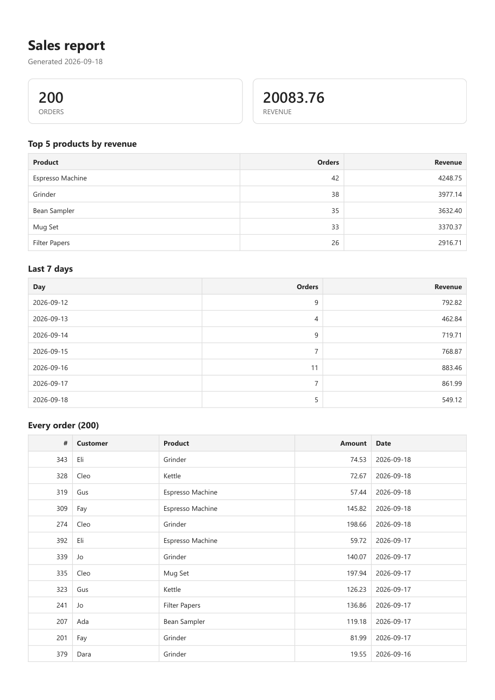

# PDF report generator

Two hundred orders go into a small database. One SQL query turns them into five
numbers. Those numbers become an HTML page, a headless browser prints that page
to a real PDF, and the API hands it over **as a link** — never as bytes in a JSON
body.

## Run it

```bash
pip install "fastapi[standard]" uvicorn playwright
playwright install chromium

python seed.py                                  # 200 fake orders into report.db
python -m uvicorn app:app --port 3000

curl -i -X POST http://localhost:3000/reports   # wait a second, get a link
curl -o my-report.pdf http://localhost:3000/reports/1/file
```

```bash
python test_report.py    # eight checks, on a throwaway copy of the database
```

`report.db` and `reports/` are gitignored. `seed.py` is their recipe, so a
stranger runs one command and has the same 200 orders — `random.seed(7)` makes
the fake data identical every time, which means two people can compare the same
report.

## Endpoints

| Method | Path | Answer |
|---|---|---|
| POST | `/reports` | **201** + `{"id","created_at","file"}` after a pause · **200** with the same id if today's report already exists · `{"force": true}` makes a new one anyway |
| GET | `/reports/{id}` | 200 — the record and its file link · 404 unknown |
| GET | `/reports/{id}/file` | 200 — the PDF itself, `application/pdf` |
| GET | `/reports` | 200 — every report, newest first |

**Store the file, pass the address.** A PDF is an *artifact*: it lives on disk and
everything else carries only its path. Only `/reports/{id}/file` ever moves
megabytes. One of the tests asserts the JSON response stays under 500 bytes, so
if someone ever base64s the PDF into it, that test fails.

## Proof

```
$ curl -i -X POST http://localhost:3000/reports
HTTP/1.1 201 Created
{"id":1,"created_at":"2026-09-18","file":"/reports/1/file"}
took 1.05 seconds

$ curl -i -X POST http://localhost:3000/reports      # asked again, same day
HTTP/1.1 200 OK
{"id":1,"created_at":"2026-09-18","file":"/reports/1/file"}

$ curl -i -X POST http://localhost:3000/reports -d '{"force":true}'
HTTP/1.1 201 Created
{"id":2,"created_at":"2026-09-18","file":"/reports/2/file"}

$ curl -o my-report.pdf http://localhost:3000/reports/1/file
downloaded 56146 bytes, type application/pdf
pages: 7
```



## The SQL

All the arithmetic happens in the database, not in Python. With 200 rows it makes
no difference; with two million it is the difference between reading five numbers
and shipping two million rows across the wire so Python can add them up.

```sql
SELECT COUNT(*) AS total_orders, ROUND(SUM(amount), 2) AS total_revenue
FROM orders;

SELECT product, COUNT(*) AS orders, ROUND(SUM(amount), 2) AS revenue
FROM orders
GROUP BY product
ORDER BY revenue DESC
LIMIT 5;

SELECT created_at AS day, COUNT(*) AS orders, ROUND(SUM(amount), 2) AS revenue
FROM orders
WHERE created_at >= date('now', 'localtime', '-6 days')
GROUP BY created_at
ORDER BY created_at;
```

## The page-break trap

A long table gets sliced by the printer. Two CSS lines fix it:

```css
thead { display: table-header-group; }   /* repeat the header on every page */
tr    { break-inside: avoid; }           /* never cut a row in half */
```

Verified mechanically rather than by eye: the test pulls the text out of all
seven pages and checks that every one of the 200 order lines still matches
`id customer product amount date` in full. A row sliced by a page break would
fail that pattern.

## When would I move this out of the request?

Right now `POST /reports` does everything inline and the caller waits about a
second. That's fine. I'd move it to a background job the moment the wait crosses
a few seconds — because a request that takes 30 seconds ties up a worker, hits
proxy timeouts, and gives the user nothing to look at. The shape it would become:
202 immediately with an id, the work in a queued job, and a status endpoint to
poll. Same pattern as the background-job assignment.

## Ask twice, get one

If today's report already exists, a second POST returns the existing one with 200
instead of generating another. A double-clicked button is the everyday case. The
expensive case is the next feature: if generating a report also emails it, then
without this check a customer gets two emails, and you cannot un-send the second.

## Two things that bit me

**`date('now')` in SQLite is UTC.** My rows were written with Python's
`date.today()`, which is local. Here that's a day ahead of UTC, so "last 7 days"
quietly returned **eight** days. The fix is `date('now', 'localtime', '-6 days')`.
I only noticed because I counted the rows in the output instead of glancing at it.

**A server was already on port 3000.** My new app failed to bind, and `curl`
cheerfully talked to the *old* app still sitting there — which answered with a
validation error from a completely different project. `curl --retry-connrefused`
proves something is listening, not that it's yours. The give-away was in the
uvicorn log: `[Errno 10048] error while attempting to bind`. When an API answers
in a way its code can't possibly produce, check what's actually on the port.
