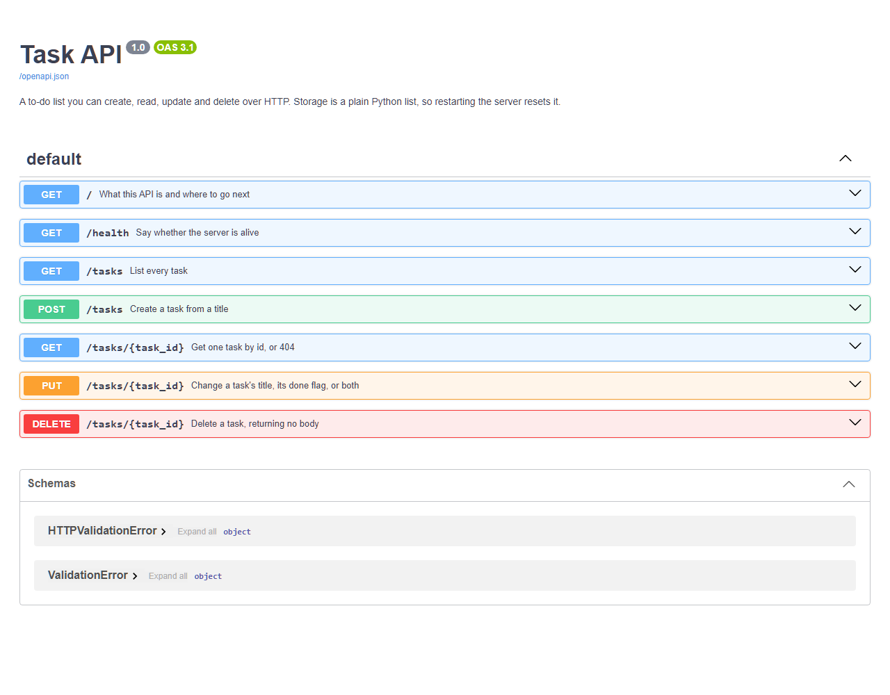

# Task API

A to-do list you can talk to over HTTP. Create a task, read one or all of them,
change one, delete one — the four CRUD operations, which is the shape almost
every backend in the world has underneath.

Storage is a plain Python list in memory. **Restart the server and your tasks are
gone**, back to the three examples. That is on purpose: it's the hole a database
fills, and next assignment fills it.

## Run it

```bash
pip install "fastapi[standard]" uvicorn
python -m uvicorn main:app --reload --port 8000
```

Then open **http://localhost:8000/docs** — that's Swagger UI, a page FastAPI
generates from your code that lets you fire every endpoint from a browser with
no curl at all.

Run the checks:

```bash
python test_api.py     # prints "all checks passed"
```

## Endpoints

| CRUD | Method | Path | Success | Errors |
|---|---|---|---|---|
| — | GET | `/` | 200 — name, version, endpoints | — |
| — | GET | `/health` | 200 `{"status":"ok"}` | — |
| Read | GET | `/tasks` | 200 — the whole list | — |
| Read | GET | `/tasks/{id}` | 200 — one task | 404 unknown id |
| Create | POST | `/tasks` | 201 — the new task | 400 missing/blank title |
| Update | PUT | `/tasks/{id}` | 200 — the updated task | 400 bad body · 404 unknown id |
| Delete | DELETE | `/tasks/{id}` | 204 — no body at all | 404 unknown id |

A task looks like `{"id": 1, "title": "Buy milk", "done": false}`. `PUT` takes
`title`, `done`, or both.

**Every error comes back the same shape** — `{"error": "..."}` — including the
ones FastAPI raises itself before reaching my code. Two exception handlers at the
top of `main.py` do that. Without them, a body that isn't valid JSON answers
`422` with a nested `{"detail": [...]}`, and a client would need two different
ways to read one API's errors.

## Proof — one real session

Headers trimmed to the status line; these are actual responses.

```
$ curl -i -X POST http://localhost:8000/tasks -H "Content-Type: application/json" -d '{"title":"Buy milk"}'
HTTP/1.1 201 Created
{"id":4,"title":"Buy milk","done":false}

$ curl -i http://localhost:8000/tasks/4
HTTP/1.1 200 OK
{"id":4,"title":"Buy milk","done":false}

$ curl -i -X PUT http://localhost:8000/tasks/4 -H "Content-Type: application/json" -d '{"done":true}'
HTTP/1.1 200 OK
{"id":4,"title":"Buy milk","done":true}

$ curl -i -X POST http://localhost:8000/tasks -H "Content-Type: application/json" -d '{}'
HTTP/1.1 400 Bad Request
{"error":"Field 'title' is required and must not be empty"}

$ curl -i http://localhost:8000/tasks/99
HTTP/1.1 404 Not Found
{"error":"Task 99 not found"}

$ curl -i -X DELETE http://localhost:8000/tasks/4
HTTP/1.1 204 No Content

$ curl -i -X POST http://localhost:8000/tasks -H "Content-Type: application/json" -d "not json"
HTTP/1.1 400 Bad Request
{"error":"Body must be a JSON object"}
```

## Swagger UI



## Notes

**404, never an empty 200.** Asking for a task that doesn't exist is a different
answer from "here is nothing". One `find()` helper raises the 404, so every
endpoint that takes an id gets the same behaviour for free — including `DELETE`,
which deletes by handing `find()`'s result straight to `list.remove`.

**Blank is not a title.** `{"title": "   "}` is rejected the same as `{}`. The
check is `.strip()`, and the stripped version is what gets stored.

**Ids come from `max(existing) + 1`, not `len(list) + 1`.** With `len`, deleting
task 3 of 3 and creating a new one would hand out id 3 again, and anything
holding the old id would silently point at the wrong task.
