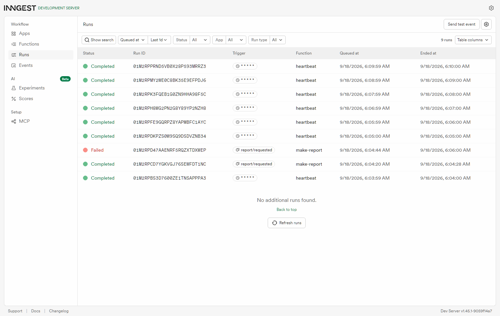
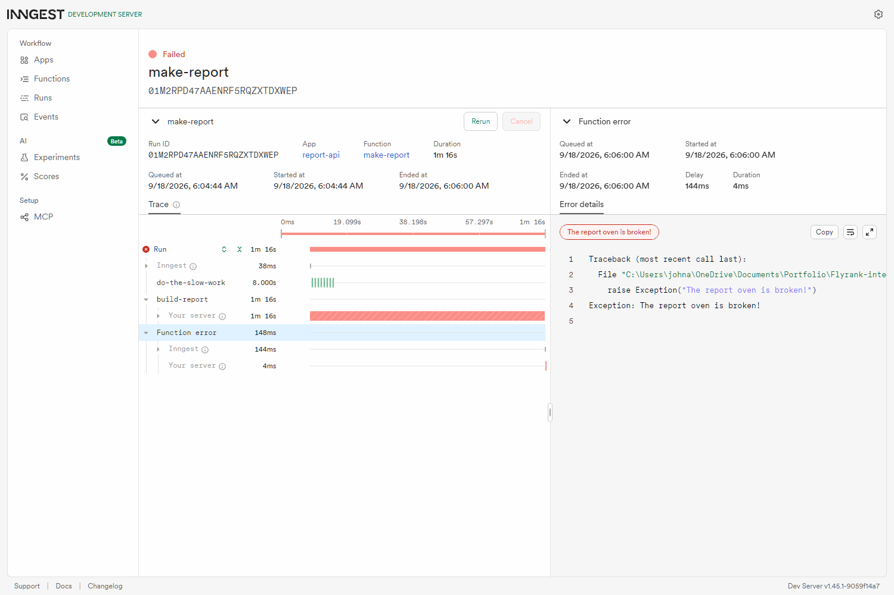

# Your first background job

An API with one slow task. It answers in **under half a second**, does the eight
seconds of work somewhere else, and tells you when the result is ready. Plus one
job that nobody asks for — the clock starts it.

## The idea in one table

| How the work starts | Example here | What it's called |
|---|---|---|
| Someone asks and waits | `GET /health` | request / response |
| Someone asks, work happens later | `POST /reports` → 202 now, report in 8s | background job |
| Nobody asks — the clock does | the every-minute summary | cron job |

The pattern the whole assignment is about: **accept fast, work in the
background, report status.** A waiter takes your order in seconds and leaves;
the kitchen takes twenty minutes. If the waiter stood at your table until the
food was ready, nobody else could order.

## Run it — you need two terminals

```bash
# Terminal 1 -- your API
pip install "fastapi[standard]" uvicorn inngest
python -m uvicorn main:app --port 3000

# Terminal 2 -- the Inngest Dev Server (no account, no card, all local)
npx inngest-cli@latest dev -u http://localhost:3000/api/inngest
```

Then open the dashboard at **http://localhost:8288**.

Two programs, and both must be running. The API only *sends* events; the Dev
Server is what stores them, decides when to run your functions, and retries them
when they fail. Forget terminal 2 and your POST still returns 202 — it just never
turns into a report, which is a confusing five minutes if you don't know to look.

```bash
python test_api.py     # five checks on the fast door; needs neither terminal
```

## Endpoints

| Method | Path | Answer |
|---|---|---|
| GET | `/health` | 200 `{"status":"ok"}` |
| POST | `/reports` | **202** + `{"id","status":"pending"}` · 400 if `topic` is missing or blank |
| GET | `/reports/{id}` | 200 — pending, then done with the result · 404 unknown |
| GET | `/reports` | 200 — everything so far |

## Proof

```
$ curl -i -X POST http://localhost:3000/reports -H "Content-Type: application/json" -d '{"topic":"cats"}'
HTTP/1.1 202 Accepted
{"id":"rep_1","status":"pending"}
caller waited: 0.385 seconds

$ curl -s http://localhost:3000/reports/rep_1
{"id":"rep_1","topic":"cats","status":"pending"}

  ... twelve seconds later ...

$ curl -s http://localhost:3000/reports/rep_1
{"id":"rep_1","topic":"cats","status":"done","result":"Report about cats: 3 findings, 1 recommendation."}
```

**202, not 200.** 200 means "here is your answer". 202 means "I've accepted this,
it isn't finished". Asking again and again until it changes is **polling**, and
the gap where the client and the server disagree about the world is **eventual
consistency** — a normal, permanent feature of this design, not a bug to fix.



Read the timestamps: `make-report` was queued at 6:04:20 and ended at 6:04:28 —
eight seconds, exactly the sleep. The heartbeats are one minute apart.

## Failure, on purpose

Posting the topic `fail` makes the build step throw. With `retries=2` the job
gets three goes in total, and the waits between them grow — that's **backoff**,
and it exists because whatever broke often needs a moment to come back.



The dashboard collapses the retries into one bar, so here is the run's own
history (`docs/retry-history.txt`, straight from the Dev Server):

```
attempt 0  StepErrored    build-report   22:04:52
attempt 1  StepScheduled  build-report   22:04:52
attempt 1  StepErrored    build-report   22:05:25     <- 33 seconds later
attempt 2  StepScheduled  build-report   22:05:25
attempt 2  StepStarted    step           22:06:00     <- 35 seconds later
attempt 0  FunctionFailed                22:06:00
```

**A wrong input is rejected at the door; only a wrong moment deserves a retry.**
`POST /reports` with no topic returns 400 and creates no job at all, because
retrying a request that was invalid the first time will be just as invalid the
tenth. A database being briefly down is the opposite case — same request, better
moment.

## Cron

`heartbeat` runs on `* * * * *` — every minute — and logs one line counting
pending, done and failed reports. The five fields are minute, hour, day of month,
month, day of week. crontab.guru is worth a bookmark.

- Every day at 08:00 → `0 8 * * *`
- Every Sunday at 22:00 → `0 22 * * 0`

**Servers usually run cron in UTC**, so "8am" on a box in another timezone is not
your 8am. Every-minute is for watching it work; nothing real should run that often.

## Two steps, not one

`make-report` is deliberately split into `step.sleep("do-the-slow-work", 8s)` and
`step.run("build-report", ...)`. Each step's result is saved once it succeeds, so
if the function crashes during the second step, the retry does **not** redo the
first one. That is what makes the job **durable** — you can kill the API mid-sleep,
start it again, and the job carries on rather than starting over.
