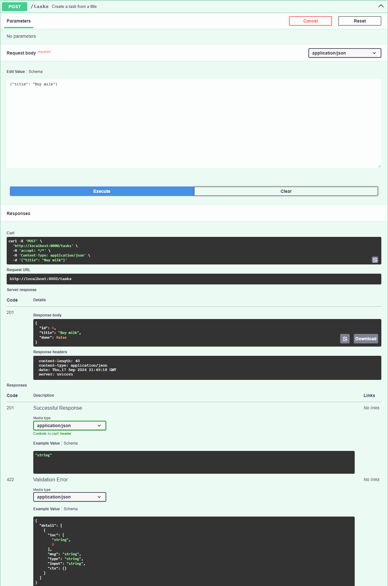
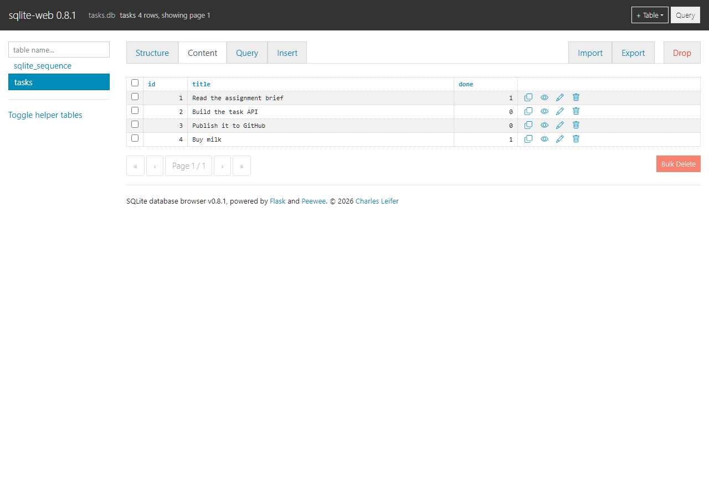

# Task API

A to-do list you can talk to over HTTP. Create a task, read one or all of them,
change one, delete one — the four CRUD operations, which is the shape almost
every backend in the world has underneath.

Storage is **SQLite**, a database that is just a file on disk -- no server to
install, no password, nothing to start. Your tasks survive a restart.

It did not start that way. The first version kept tasks in a Python list in
memory and lost everything on restart. Swapping in a database touched exactly one
new file, `db.py`, and left every URL, request body and response byte-for-byte
identical. That is the point of the exercise.

## Run it

```bash
pip install "fastapi[standard]" uvicorn
python -m uvicorn main:app --reload --port 8000
```

`tasks.db` is created next to `main.py` on first run, the `tasks` table with it,
and three example tasks are inserted **only if the table is empty** -- so
restarting never duplicates them. The file is gitignored; the code is its recipe.
Point it somewhere else with the `TASKS_DB` environment variable, which is how
the tests keep their hands off your real data.

Then open **http://localhost:8000/docs** — that's Swagger UI, a page FastAPI
generates from your code that lets you fire every endpoint from a browser with
no curl at all.

Run the checks:

```bash
python test_api.py     # prints "all checks passed"
```

## Endpoints

| CRUD | Method | Path | Success | Errors |
|---|---|---|---|---|
| — | GET | `/` | 200 — name, version, endpoints | — |
| — | GET | `/health` | 200 `{"status":"ok"}` | — |
| Read | GET | `/tasks` | 200 — the whole list | — |
| Read | GET | `/tasks/{id}` | 200 — one task | 404 unknown id |
| Create | POST | `/tasks` | 201 — the new task | 400 missing/blank title |
| Update | PUT | `/tasks/{id}` | 200 — the updated task | 400 bad body · 404 unknown id |
| Delete | DELETE | `/tasks/{id}` | 204 — no body at all | 404 unknown id |

A task looks like `{"id": 1, "title": "Buy milk", "done": false}`. `PUT` takes
`title`, `done`, or both.

**Every error comes back the same shape** — `{"error": "..."}` — including the
ones FastAPI raises itself before reaching my code. Two exception handlers at the
top of `main.py` do that. Without them, a body that isn't valid JSON answers
`422` with a nested `{"detail": [...]}`, and a client would need two different
ways to read one API's errors.

## Proof — one real session

Headers trimmed to the status line; these are actual responses.

```
$ curl -i -X POST http://localhost:8000/tasks -H "Content-Type: application/json" -d '{"title":"Buy milk"}'
HTTP/1.1 201 Created
{"id":4,"title":"Buy milk","done":false}

$ curl -i http://localhost:8000/tasks/4
HTTP/1.1 200 OK
{"id":4,"title":"Buy milk","done":false}

$ curl -i -X PUT http://localhost:8000/tasks/4 -H "Content-Type: application/json" -d '{"done":true}'
HTTP/1.1 200 OK
{"id":4,"title":"Buy milk","done":true}

$ curl -i -X POST http://localhost:8000/tasks -H "Content-Type: application/json" -d '{}'
HTTP/1.1 400 Bad Request
{"error":"Field 'title' is required and must not be empty"}

$ curl -i http://localhost:8000/tasks/99
HTTP/1.1 404 Not Found
{"error":"Task 99 not found"}

$ curl -i -X DELETE http://localhost:8000/tasks/4
HTTP/1.1 204 No Content

$ curl -i -X POST http://localhost:8000/tasks -H "Content-Type: application/json" -d "not json"
HTTP/1.1 400 Bad Request
{"error":"Body must be a JSON object"}
```

## Swagger UI

FastAPI reads my function names, type hints and `summary=` text and builds this
page itself. There is no hand-written spec file in this repo.


Full CRUD works from this page with no curl. Here is **Try it out** on
`POST /tasks`, executed live against the running server:



## Notes

**404, never an empty 200.** Asking for a task that doesn't exist is a different
answer from "here is nothing". One `find()` helper raises the 404, so every
endpoint that takes an id gets the same behaviour for free — including `DELETE`,
which deletes by handing `find()`'s result straight to `list.remove`.

**Blank is not a title.** `{"title": "   "}` is rejected the same as `{}`. The
check is `.strip()`, and the stripped version is what gets stored.

**Ids come from SQLite, not from me.** The column is
`INTEGER PRIMARY KEY AUTOINCREMENT`, so the database hands out the next number
and never reuses one. The in-memory version computed `max(id) + 1` in Python,
which two requests arriving together could both read before either wrote.

**SQLite has no boolean.** `done` is stored as `0` or `1`, so `db.as_task()`
converts it back to `true`/`false` on the way out. Without that one line the API
would quietly start answering `"done": 1`, and every client comparing to `true`
would break.

**`with sqlite3.connect(...)` does not close the connection.** It only commits or
rolls back the transaction. I found out because a test could not delete its own
database file -- Windows refuses to delete a file something still has open. The
fix is `contextlib.closing` around it, in `db.py`.

## The database

`db.py` is the only file that writes SQL. `main.py` calls `db.all_tasks()`,
`db.insert()` and so on, and would not notice if the storage underneath changed.

### Seeing inside it

```bash
pip install sqlite-web
python -m sqlite_web.sqlite_web --port 8090 tasks.db
```



(Note: `python -m sqlite_web` crashes with an `ImportError` in version 0.8.1 --
its `__main__.py` imports a `main` that no longer exists. `sqlite_web.sqlite_web`
is the module that actually runs.)

### The API is only a window onto the file

Here is the lesson of this stage. With the server running and untouched, I
changed the data by hand:

```
$ curl -s localhost:8000/tasks
[{"id":1,...},{"id":2,...},{"id":3,...}]          # three tasks

sqlite> UPDATE tasks SET done = 1;
sqlite> DELETE FROM tasks WHERE done = 1;

$ curl -s localhost:8000/tasks
[]                                                 # no restart, no code change
```

The API had no cached copy to go stale, because it never held one. Every request
asks the file. A few queries worth knowing:

```sql
SELECT * FROM tasks;                  -- everything
SELECT * FROM tasks WHERE done = 1;   -- just the finished ones
SELECT COUNT(*) FROM tasks;           -- how many rows
```

## Third storage engine, same routes

| Version | Where tasks live | What runs it |
|---|---|---|
| A1 | a Python list | the program itself |
| A2 | `tasks.db` | SQLite, a file on your disk |
| A3 | rows in `tasks` | Postgres, a database server in a container |

> **Unverified: the Postgres path has not been run.** Docker is not installed on
> this machine, so `docker compose up` has never executed here. What *is* checked:
> `db_postgres.py` exposes the same eight functions with the same signatures as
> `db.py` (a script asserts it), `compose.yaml` parses, and the SQLite path still
> passes all four test groups. Treat the Postgres side as written-but-untested
> until you have run the command below.

```bash
cp .env.example .env
docker compose up
curl -i http://localhost:3000/tasks
```

**Only `db_postgres.py` and the infrastructure files are new.** `main.py` gained
four lines, and they are a choice of import:

```python
if os.environ.get("DATABASE_URL"):
    import db_postgres as db
else:
    import db
```

Every route, every status code and every response body is untouched. That is what
"storage is an implementation detail" means in practice: three completely
different engines, one unchanged API.

### Things the compose file is doing on purpose

**`db`, not `localhost`.** Inside compose, each container has its own localhost,
so `localhost` from the API container means the API container itself. Containers
reach each other by service name.

**`condition: service_healthy`.** Plain `depends_on` only waits for the database
*container* to exist, not for Postgres inside it to be ready for connections. The
API would start, fire its first query into a socket nobody is listening on, and
crash. The healthcheck runs `pg_isready` until the database actually answers.

**The named volume.** Without `taskdata`, rows live inside the container and die
with it -- `docker compose down` then `up` would give you three seeded tasks
again and a shrug. The volume is what makes the data survive.

### Placeholders change shape, not meaning

SQLite writes `?`, Postgres writes `%s`. Both mean the same thing: **this is a
value, never code.** Gluing an id straight into the SQL string is how injection
happens -- an id of `1; DROP TABLE tasks` would simply be executed. Passed as a
parameter, the exact same text is only ever compared against a column.

## POST /triage — an LLM behind the API

One messy sentence in, one clean validated object out. Not a chatbot: no
conversation, no memory, one decision.

> **Unverified against a real model.** Everything below runs and is tested in
> **stub mode**, which uses keyword rules instead of an LLM. I do not have an
> OpenRouter key yet, so no live call has been made from this repo. The eval
> score quoted is the stub's, and a stub's score says nothing about a model's.

```bash
cp .env.example .env
LLM_STUB=1 python -m uvicorn main:app --port 3000

curl -i -X POST http://localhost:3000/triage   -H "Content-Type: application/json"   -d '{"text":"You charged me twice for March and I want one of them back."}'
```

```
HTTP/1.1 200 OK
{"category":"billing","urgency":"high","confidence":0.8,
 "reason":"Stub classifier matched on billing keywords."}
```

And a deliberately broken one:

```
$ curl -i -X POST http://localhost:3000/triage -H "Content-Type: application/json" -d '{"text":""}'
HTTP/1.1 400 Bad Request
{"error":"text: String should have at least 1 character"}
```

The 400 **names the field**. `{"error":"Bad request"}` is useless to whoever has
to fix the caller.

See [JOB-CARD.md](JOB-CARD.md) for the job, the closed lists, and the "must
never" rules.

### Swapping providers is three environment variables

```
LLM_BASE_URL=https://openrouter.ai/api/v1     # or http://localhost:11434/v1/ for Ollama
LLM_API_KEY=your_key                          # or the literal word "ollama"
LLM_MODEL=openrouter/free                     # or gemma3:1b
```

That is the whole difference between a model on your laptop and one in a
datacentre. Most providers copied OpenAI's request shape, so the same `openai`
package talks to all of them.

**OpenRouter trap:** free models answer `404 — No endpoints available matching
your guardrail restrictions` until you turn ON both switches at
Settings → Privacy. Because of that setting your prompts may be trained on and
published, so **only ever send made-up test data**. The free tier is 50 requests
a day and **failed requests count**, which a bad retry loop can burn in about
ninety seconds.

### Eval — 6/8, stub mode, prompt triage-v1, 18 Sep 2026

```
ok   #1  want billing  got billing   conf 0.8
ok   #2  want bug      got bug       conf 0.8
ok   #3  want feature  got feature   conf 0.8
ok   #4  want billing  got billing   conf 0.8
MISS #5  want bug      got other     conf 0.3
ok   #6  want other    got other     conf 0.3
MISS #7  want feature  got other     conf 0.3
ok   #8  want other    got other     conf 0.3
```

6/8 is 6/8. Both misses are the cases I labelled ambiguous on purpose:

- **#5** *"Export to CSV returns an empty file for accounts with over 10000
  rows"* — a real bug, described calmly. The stub only knows words like "crash"
  and "broken", so it has nothing to match. A model should get this one.
- **#7** *"Can you add SSO? Right now our finance team can't log in at all"* —
  reads as an urgent bug and is actually a request for something that does not
  exist yet. I labelled it `feature` and I would not blame anyone for arguing.

What is good is that it **missed with low confidence** — 0.3 on both, and it
said "found nothing it recognised" rather than inventing a category. A wrong
answer that admits it is unsure is a different thing from a confident wrong one.

Run it yourself: `python evals/run.py`. On OpenRouter that is 8 of your 50 calls.

### One call's cost log

```json
{"at":"2026-09-18T13:55:16+00:00","mode":"stub","repairs":0,
 "prompt_version":"triage-v1","duration_ms":0}
```

Live calls add `model`, `input_tokens` and `output_tokens`. The prompt is roughly
**450 tokens** and a reply about **40**, so ~490 tokens a call. At 10,000 requests
a day that is around **4.9 million tokens/day**. On a free tier it is simply
impossible — 50 a day — and on a paid tier at $0.15 per million input tokens it
is well under a dollar a day, until repairs double some of them. **Repairs are
the cost driver to watch**, which is exactly why `repairs` is in every log line.

### The parts that are not the AI call

The model call is about thirty lines. The rest is what makes it safe to leave
running:

| Property of an LLM | What this repo does about it |
|---|---|
| **Slow** | An explicit 30s timeout. The OpenAI SDK's default is **ten minutes** — leaving it is the classic mistake, and a test asserts it is ≤60s. |
| **Non-deterministic** | `temperature: 0`, plus eight hand-labelled cases so a prompt change has a number attached. |
| **Costs money** | A cost log per call, `LLM_STUB=1` to build for free, and `LLM_ENABLED=false` as a kill switch that stops every call without a deploy. |
| **Confidently wrong** | Output is untrusted input: parse, validate against enums, repair once, then 422 and quarantine. |

**Retries go one way only.** Timeouts, 429 and 5xx get retried with exponential
backoff plus jitter (1s, 2s, plus a random fraction so everyone who failed
together doesn't return together). 400, 401 and 403 are **never** retried — a
wrong key is still wrong on the third try, and each attempt burns one of the
day's 50.

**One repair, never two.** If the model returns `"category":"urgent"`, it gets
its own validation error handed back once. If it fails again, the endpoint
answers **422** and writes the raw output to `logs/quarantine.jsonl` with the
input, the error and the prompt version. The process never crashes and never
invents a default — a faked default is a wrong answer nobody can find later.

**Raw model text never reaches the caller**, on success or on failure.

**The customer's words go in their own user message, JSON-encoded** — never
glued into the system prompt. That is the first OWASP LLM mitigation: if
untrusted text sits inside your rules, the model cannot tell rules from data,
and "ignore your instructions" starts working. There is a test for it, and case
#8 in the eval set is a real injection attempt.

### What I would fix with another day

Get a key and run the eval against a real model, because a stub's 6/8 proves the
plumbing works and nothing about whether the prompt is any good. Then a request
cache keyed on input **plus prompt version**, so re-running the eval while
tweaking wording doesn't cost 8 calls each time.
