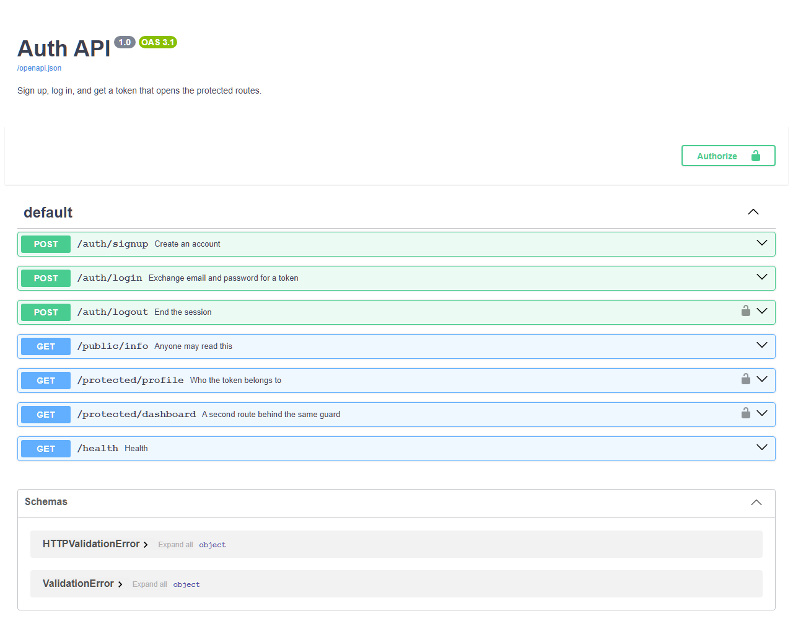

# Auth API — login and protect

Sign up, log in, get a token, and use that token to open doors that are shut to
everyone else. Supabase handles accounts and passwords; this API decides who gets
in.

> **Status: verified end to end against a real Supabase project, 20 Sep 2026.**
> Signup, login, both protected routes, a tampered token, a wrong password and
> logout all ran live and returned the codes shown below. The nine checks in
> `test_auth.py` use a fake identity provider, so they need no account, no key
> and no network.

## The trust triangle

Three parties, and your server is only one of them:

1. The client sends email and password **to Supabase**, not to me.
2. Supabase checks them and returns a **JWT** — a signed string that says "this
   is user 123". Signed means I can tell if someone edited it.
3. The client calls my API with that token in the `Authorization` header.
4. I ask Supabase "whose token is this?" and serve the route if the answer is a
   real person.

My server never sees a password. That is the point — the thing I don't store I
can't leak.

## Setup

```bash
pip install "fastapi[standard]" uvicorn supabase python-dotenv
cp .env.example .env        # then paste your own values in
python -m uvicorn main:app --port 3000
```

Get the two values from the Supabase dashboard: **Settings → API Keys** gives
you the **Project URL** and the public key.

Supabase renamed that key. It is now the **publishable** key (`sb_publishable_…`);
the older **anon** key (a long `eyJ…` string) still works and is what the
assignment brief calls it, but anon and service_role are being retired by the end
of 2026. Either one goes in `SUPABASE_KEY`. The **secret** key is a different
thing entirely and must never leave your server.

```
SUPABASE_URL=https://your-project-ref.supabase.co
SUPABASE_KEY=your_anon_public_key
```

**`.env` is in `.gitignore`, and it was there before the first commit.** That
order matters more than it sounds. A key pushed once lives in git history
forever — deleting the file in a later commit does nothing, because the old
commit is already in every clone anyone made. `.env.example` is committed instead:
the names, never the values.

```bash
python test_auth.py     # nine checks, no account and no network needed
```

## Routes

| Method | Path | Needs a token | Answers |
|---|---|---|---|
| POST | `/auth/signup` | no | **201** + the new user · 400 missing email or password |
| POST | `/auth/login` | no | 200 + `access_token` · 400 missing fields · **401** wrong password |
| POST | `/auth/logout` | **yes** | **204**, empty body · 401 without a token |
| GET | `/public/info` | no | 200 — open to anyone |
| GET | `/protected/profile` | **yes** | 200 + id, email, created-at · 401 otherwise |
| GET | `/protected/dashboard` | **yes** | 200 — proves the guard is reusable |



The padlock appears on exactly three rows. Click **Authorize**, paste a token
from `/auth/login`, and **Try it out** works on the protected endpoints.

## 400 and 401 are different answers

- **400** — you sent me a broken request. No email field at all.
- **401** — I read your credentials and they were wrong, or absent.

Mixing them leaks information. Answering 401 to a request with no password tells
someone "your credentials failed" when I never looked at any. And Supabase
deliberately says `Invalid login credentials` for *both* a wrong password and an
unknown email, so nobody can use the login form to find out which addresses have
accounts here.

## The guard is a dependency, not a copy-pasted check

```python
def current_user(creds = Depends(bearer)) -> dict:
    if creds is None or not creds.credentials:
        raise HTTPException(401, "Access token required")
    return identity.user_from_token(creds.credentials)
```

Any route that wants a logged-in user writes `user: dict = Depends(current_user)`
and gets one. FastAPI runs the guard first and the route body never starts if it
raises. `/protected/dashboard` exists purely to prove that adding a second locked
route is one line, not a second copy of the check — and a copy is exactly how a
route ends up accidentally unprotected six months later.

`HTTPBearer(auto_error=False)` is deliberate: with the default, FastAPI rejects a
missing header itself and answers `{"detail": ...}`. Turning it off lets the
header reach my code so every error in this API has the same `{"error": ...}` shape.

The test that matters most fires six broken headers at both protected routes —
no header, empty header, a token with no `Bearer ` prefix, `Bearer` with nothing
after it, the wrong scheme, and a valid token with **one character changed**. All
six must be 401.

## One real session

```
public route                       200  {"message":"Welcome stranger! This info is public."}
protected, no header               401  {"error":"Access token required"}
signup                             201  {"id":"735f6698-...","email":"be03user96537@flyrank-test.dev",...}
login                              200  {"access_token":"<hidden>","refresh_token":"<hidden>","token_type":"bearer","expires_in":3600}
profile with real token            200  {"id":"735f6698-...","email":"be03user96537@flyrank-test.dev",...}
dashboard with real token          200  {"message":"Welcome back, be03user96537@flyrank-test.dev.",...}
profile with TAMPERED token        401  {"error":"Invalid or expired token"}
wrong password                     401  {"error":"Invalid login credentials"}
logout                             204
```

The tampered-token line is the one that matters. I took a working token, changed
**one character in the middle**, and sent it again. If that had still returned
200, the signature would not be getting checked and the whole assignment would be
failing silently while looking fine.

## Two traps that each cost me a signup

**`@example.com` is rejected outright.** Supabase answers
`Email address "test@example.com" is invalid` -- it blocks reserved test domains,
and `example.com` is the first one anybody reaches for. The assignment brief uses
it in its own example curl. Use something that looks like a real domain;
`flyrank-test.dev` works.

**Then every other domain said `email rate limit exceeded`.** That is not a cap
on signups, it is a cap on *emails*. A new project has email confirmation
switched on, so each signup tries to send a message, and the free tier's built-in
mailer allows only a handful an hour. Two errors that look unrelated, one cause.

The fix, written down rather than clicked:

```bash
npx supabase init
npx supabase link --project-ref <your-ref>
npx supabase config push          # sets auth.email.enable_confirmations = false
```

`supabase/config.toml` is committed, so the setting lives in the repo instead of
being something somebody once toggled in a dashboard and forgot. Confirmation off
is right for a throwaway practice project and wrong for anything real.

**One sharp edge in the CLI.** `supabase projects api-keys` returns four keys for
a new project, and **two of them are both named `default`** -- one
`sb_publishable_...` and one `sb_secret_...`. Choosing by name is a coin flip
between the public key and the one that bypasses every access rule, so `.env`
here is written by matching the value's `sb_publishable_` prefix instead.

## Also worth knowing

**`sign_out`.** The brief writes `signOut(token)`, but the SDK's `sign_out()`
ends the client's *own* session — it does not take someone else's token and
revoke it. Killing another session server-side goes through the admin API with
the service-role key, which is not the anon key and must never reach a browser.
